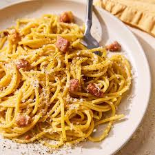

Sure! Here's a `README.md` file for your **Spaghetti Carbonara** HTML page:

---

```markdown
# 🍝 Spaghetti Carbonara Recipe

Welcome to the ultimate guide for making rich and creamy spaghetti carbonara! This classic Italian dish combines al dente pasta, crispy pancetta, and a silky egg-and-cheese sauce for a comforting meal that's both simple and indulgent. Follow this easy recipe to create a restaurant-quality carbonara right in your own kitchen—perfect for cozy dinners or impressing your guests.

## 📷 Preview



## 🧾 Ingredients

- 400g (14 oz) spaghetti  
- 150g (5 oz) pancetta or guanciale, diced  
- 2 large eggs  
- 1 large egg yolk  
- 1 cup (100g) freshly grated Pecorino Romano cheese (or Parmesan)  
- 2 cloves garlic, peeled (optional)  
- Freshly ground black pepper  
- Salt  
- Olive oil (just a drizzle, optional)  

## 👨‍🍳 Instructions

1. **Cook the Pasta**  
   Boil salted water and cook the spaghetti until al dente. Reserve 1 cup of pasta water, then drain.

2. **Cook the Pancetta/Guanciale**  
   In a skillet over medium heat, cook pancetta until golden and crispy. Optionally add garlic and discard after browning.

3. **Mix Eggs and Cheese**  
   In a bowl, whisk eggs, yolk, cheese, and a generous amount of black pepper.

4. **Combine**  
   Add drained pasta to the skillet (heat off), then add egg mixture. Toss quickly, adding pasta water until creamy.

5. **Serve**  
   Serve immediately with extra cheese and pepper on top.

## 🧑‍💻 Project Details

This is a simple HTML recipe page. To view it, open `index.html` in your browser.  
Make sure `dish-image.jpg` is located in the same directory as your HTML file to display the image correctly.

---

Enjoy your delicious homemade carbonara! 🇮🇹
```

---

Let me know if you’d like a downloadable PDF version or want to add CSS for styling the page.
